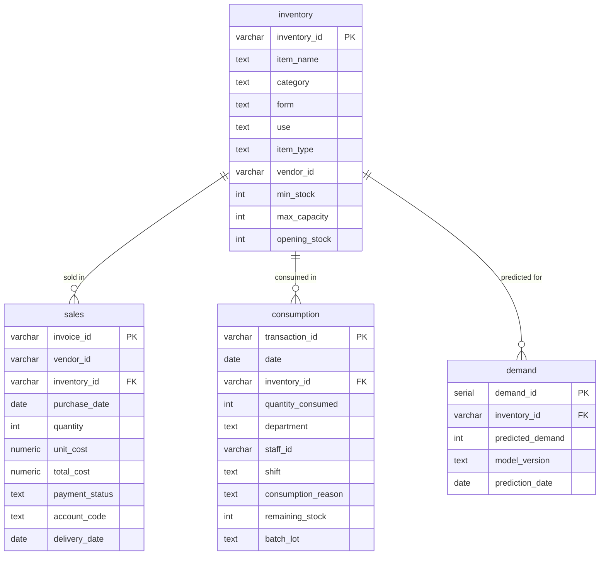

# ER Diagram & Normalization

Entity–relationship view of the SmartCartAI schema and how it satisfies normal forms.

---

## ER Diagram (Mermaid)

---

## Normalization

### 1NF (First Normal Form)

- **Rule**: Atomic values; no repeating groups; each row uniquely identified.
- **Applied**:
  - All attributes hold single values (no lists or nested structures).
  - No repeating groups (e.g. multiple “quantity” columns).
  - Each table has a primary key: `inventory_id`, `invoice_id`, `transaction_id`, `demand_id`.

### 2NF (Second Normal Form)

- **Rule**: 1NF + every non-key attribute depends on the **whole** primary key (no partial dependency).
- **Applied**:
  - **inventory**: PK is `inventory_id` (single column); all attributes describe the inventory item.
  - **sales**: PK is `invoice_id`; attributes describe the invoice line (vendor, inventory, dates, costs, etc.).
  - **consumption**: PK is `transaction_id`; attributes describe the consumption event.
  - **demand**: PK is `demand_id`; attributes describe the prediction. No composite PKs, so no partial dependencies.

### 3NF (Third Normal Form)

- **Rule**: 2NF + no non-key attribute depends on another non-key attribute (no transitive dependency).
- **Applied**:
  - **inventory**: Non-key attributes (item_name, category, form, use, item_type, vendor_id, min_stock, max_capacity, opening_stock) depend only on `inventory_id`. `vendor_id` is a reference; moving vendor details to a separate `vendor` table would be a further 3NF refinement if vendor name/address were stored here.
  - **sales**: Attributes depend on the invoice line; `inventory_id` and `vendor_id` are FKs, not stored descriptive attributes that depend on each other.
  - **consumption**: Attributes depend on the transaction; `inventory_id` is FK only.
  - **demand**: Attributes depend on the prediction record; `inventory_id` is FK only.

### Summary

| Table        | 1NF | 2NF | 3NF |
|-------------|-----|-----|-----|
| inventory   | ✓   | ✓   | ✓   |
| sales       | ✓   | ✓   | ✓   |
| consumption | ✓   | ✓   | ✓   |
| demand      | ✓   | ✓   | ✓   |

The schema is in **third normal form (3NF)**. Optional improvement: introduce a `vendor` table and reference it from `inventory` and `sales` if you add vendor-specific attributes (name, address, etc.) to avoid repeating them.
