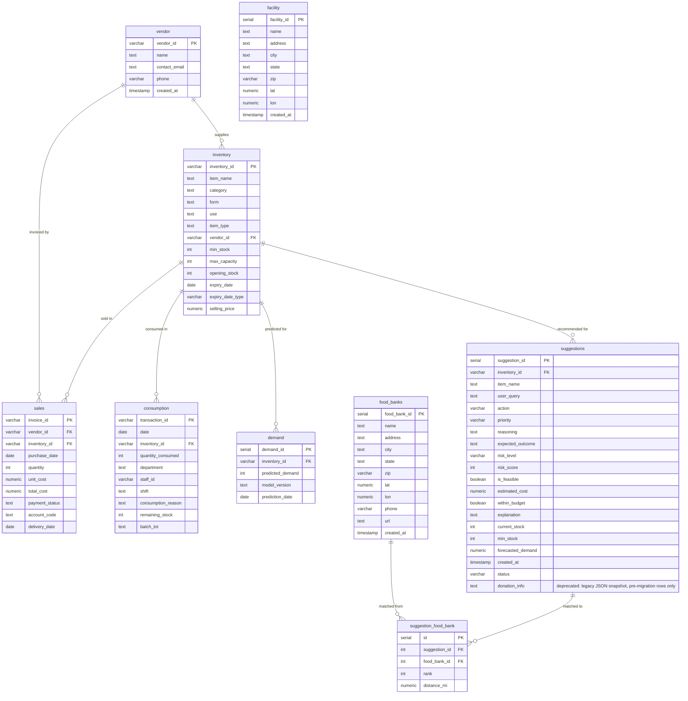

# ER Diagram & Normalization

Entity–relationship view of the SmartCartAI schema and how it satisfies normal forms.

---

## ER Diagram (Mermaid)

---

## Normalization

### 1NF (First Normal Form)

- **Rule**: Atomic values; no repeating groups; each row uniquely identified.
- **Applied**:
  - All attributes hold single values (no lists or nested structures).
  - No repeating groups (e.g. multiple “quantity” columns).
  - Each table has a primary key: `inventory_id`, `invoice_id`, `transaction_id`, `demand_id`.

### 2NF (Second Normal Form)

- **Rule**: 1NF + every non-key attribute depends on the **whole** primary key (no partial dependency).
- **Applied**:
  - **inventory**: PK is `inventory_id` (single column); all attributes describe the inventory item.
  - **sales**: PK is `invoice_id`; attributes describe the invoice line (vendor, inventory, dates, costs, etc.).
  - **consumption**: PK is `transaction_id`; attributes describe the consumption event.
  - **demand**: PK is `demand_id`; attributes describe the prediction.
- **suggestions**: PK is `suggestion_id`; attributes describe the AI recommendation; `inventory_id` is FK.
- **facility**: PK is `facility_id`; attributes describe the store location.
- **food_banks**: PK is `food_bank_id`; attributes describe the food bank. No composite PKs, so no partial dependencies.
- **vendor**: PK is `vendor_id`; attributes describe the vendor.
- **suggestion_food_bank**: PK is `id`; `rank`/`distance_mi` describe the (suggestion, food bank) match itself, not either FK column alone -- this is why it's a separate table rather than columns bolted onto `suggestions`.

### 3NF (Third Normal Form)

- **Rule**: 2NF + no non-key attribute depends on another non-key attribute (no transitive dependency).
- **Applied**:
  - **inventory**: Non-key attributes (item_name, category, form, use, item_type, vendor_id, min_stock, max_capacity, opening_stock, expiry_date, expiry_date_type, selling_price) depend only on `inventory_id`. `vendor_id` is now a proper FK into `vendor` (see below) rather than a repeated code.
  - **sales**: Attributes depend on the invoice line; `inventory_id` and `vendor_id` are FKs, not stored descriptive attributes that depend on each other.
  - **consumption**: Attributes depend on the transaction; `inventory_id` is FK only.
  - **demand**: Attributes depend on the prediction record; `inventory_id` is FK only.
  - **suggestions**: Attributes depend on the recommendation; `inventory_id` is FK only. `donation_info` (legacy JSON snapshot) is deprecated -- it stored `food_banks.name`/`address` as a duplicated blob (a transitive dependency, not just JSON-in-TEXT), which `suggestion_food_bank` below removes.
  - **vendor**: Attributes (name, contact_email, phone) depend only on `vendor_id`.
  - **suggestion_food_bank**: `food_bank_id` references `food_banks` by key only; name/address are looked up via the FK at read time instead of being copied in, so there's no transitive dependency on `food_banks`' non-key columns.
  - **facility** and **food_banks**: Standalone reference data; no transitive dependencies.

### Summary

| Table                 | 1NF | 2NF | 3NF |
|-----------------------|-----|-----|-----|
| inventory              | ✓   | ✓   | ✓   |
| sales                  | ✓   | ✓   | ✓   |
| consumption            | ✓   | ✓   | ✓   |
| demand                 | ✓   | ✓   | ✓   |
| suggestions            | ✓   | ✓   | ✓   |
| vendor                 | ✓   | ✓   | ✓   |
| suggestion_food_bank   | ✓   | ✓   | ✓   |
| facility               | ✓   | ✓   | ✓   |
| food_banks             | ✓   | ✓   | ✓   |

The schema is in **third normal form (3NF)**.

**Notes:**
- **suggestions**: AI-generated recommendations; `inventory_id` FK links to the item. `donation_info` (TEXT) is a deprecated JSON snapshot of nearest food banks, kept only so suggestions written before `suggestion_food_bank` existed still render; new rows are written to `suggestion_food_bank` instead (see below).
- **suggestion_food_bank**: Normalized nearest-food-bank match per suggestion (`suggestion_id` FK, `food_bank_id` FK, `rank`, `distance_mi`). One row per match instead of a JSON array in a TEXT column, so matches can be queried/joined/indexed and don't duplicate `food_banks.name`/`address`.
- **vendor**: Referenced from `inventory.vendor_id` and `sales.vendor_id` (both FK, `database/migrations/add_vendor_table.sql`). Previously `vendor_id` was a bare code with no lookup entity or referential integrity.
- **facility**: Store/warehouse location (lat/lon) used by the Food Bank agent as the origin for "nearest" distance.
- **food_banks**: Reference list of food banks (name, address, lat/lon); Food Bank agent computes nearest by distance; referenced by `suggestion_food_bank.food_bank_id`.
