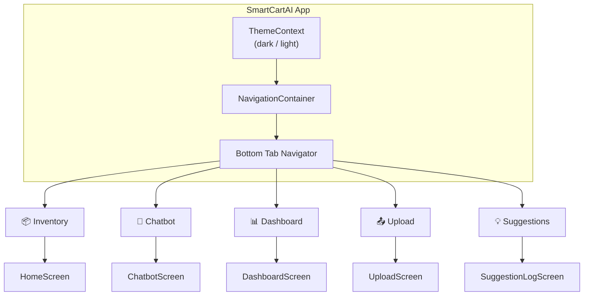
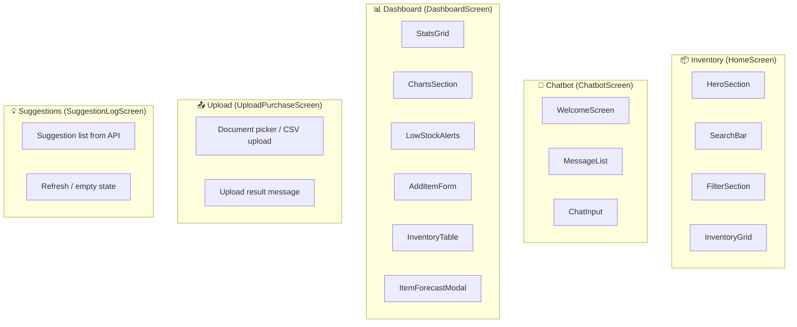
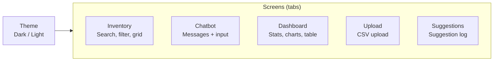

# SmartCartAI – UI Design Diagram

High-level structure of the mobile UI (React Native / Expo). Screens, tabs, and main components only.

---

## 1. App structure (navigation)



---

## 2. Screen → components (UI only)



---

## 3. Screen layout (what the user sees)

| Tab | Screen | Main UI blocks (top → bottom) |
|-----|--------|-------------------------------|
| **Inventory** | HomeScreen | Logo/header → HeroSection (stats) → SearchBar → FilterSection (status/sort) → InventoryGrid (cards) |
| **Chatbot** | ChatbotScreen | Welcome / quick questions → MessageList (chat bubbles) → ChatInput (text + send) |
| **Dashboard** | DashboardScreen | StatsGrid (Total / In stock / Low stock / Out of stock) → ChartsSection → LowStockAlerts → AddItemForm → InventoryTable (tap row → ItemForecastModal) |
| **Upload** | UploadPurchaseScreen | Title → “Pick CSV” button → Upload → Success/error message |
| **Suggestions** | SuggestionLogScreen | Title → List of suggestions (item, action, priority, reasoning, etc.) or empty state |

---

## 4. Component hierarchy (simplified)

```
App (App.js)
└── ThemeProvider
    └── AppNavigator
        └── NavigationContainer
            └── Tab.Navigator (5 tabs)
                ├── Inventory  → HomeScreen
                │                 ├── HeroSection
                │                 ├── SearchBar
                │                 ├── FilterSection
                │                 └── InventoryGrid (InventoryCard per item)
                │
                ├── Chatbot   → ChatbotScreen
                │                 ├── WelcomeScreen (quick questions)
                │                 ├── MessageList (user/bot messages)
                │                 └── ChatInput
                │
                ├── Dashboard → DashboardScreen
                │                 ├── StatsGrid
                │                 ├── ChartsSection
                │                 ├── LowStockAlerts
                │                 ├── AddItemForm
                │                 ├── InventoryTable
                │                 └── ItemForecastModal (modal)
                │
                ├── Upload    → UploadPurchaseScreen
                │                 └── (picker + result UI)
                │
                └── Suggestions → SuggestionLogScreen
                                    └── (list / refresh / empty)
```

---

## 5. Visual summary (one screen per box)



---

**Location of UI code**

- **Navigation:** `SmartCartAIFrontEnd/mobile/src/navigation/AppNavigator.js`
- **Screens:** `SmartCartAIFrontEnd/mobile/src/screens/`
- **Components:** `SmartCartAIFrontEnd/mobile/src/components/`
- **Theme:** `SmartCartAIFrontEnd/mobile/src/theme.js` + `contexts/ThemeContext.js`
