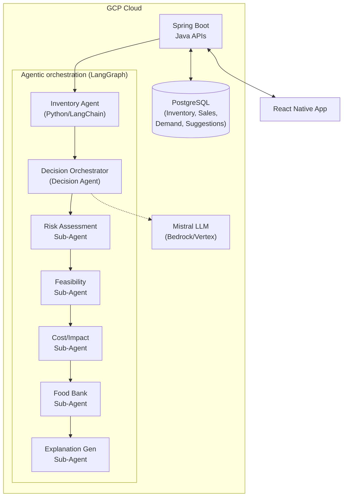
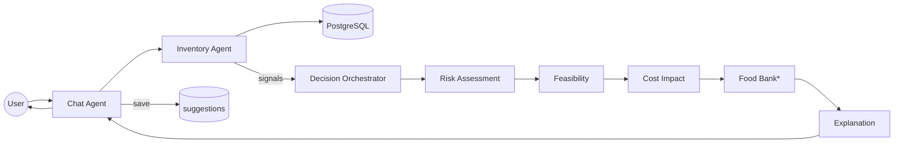
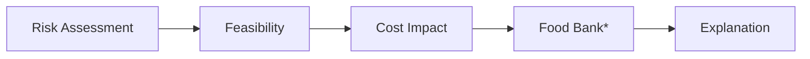
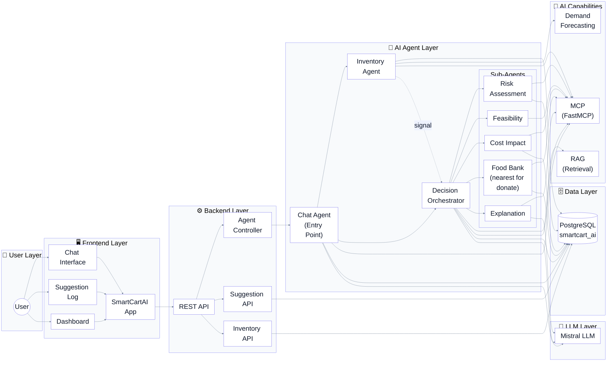

# Architecture Overview 📋

This document maps the repository structure to the architecture diagram (see `Dataset/SmartCartAI_UseCases.drawio`) and describes the **user-facing flow**.

## User-facing flow (Chat → Inventory → Decision → Explanation → User)

1. **Chat Agent** (open endpoint) — The user interacts here. Backend exposes `POST /api/agents/chat` and proxies to the Chat Agent (port 9006).

2. **Chat Agent calls Inventory Agent** — For each user query, the Chat Agent calls the Inventory Agent with the query. The Inventory Agent is the single place that interprets the user’s intent and **sees the database** (low stock, expired, near expiring, items going to waste, reorder, suggest, etc.).

3. **Inventory Agent** — Queries the DB based on the user query and returns **signals** (items that need attention). It can also send events to the Decision Agent (e.g. when running continuous monitoring or when processing a single event via `POST /inventory`).

4. **Decision Orchestration Agent** — Receives signals (per item) and **orchestrates sub-agents** in sequence: Risk Assessment → Feasibility → Cost Impact → **Food Bank** (when discard/donate) → **Explanation Agent** → synthesizes the final recommendation.

5. **Explanation Agent** — Produces the human-readable explanation and recommendation. That output is included in the Decision Orchestrator’s response.

6. **Back to Chat Agent** — The Chat Agent receives the recommendation (including explanation) for each item, returns the answer to the **user** and persists entries in the **Suggestion** tab (suggestions table).

```
User → Chat Agent → Inventory Agent (DB: low stock / expired / waste / …)
                          ↓
                     signals (items)
                          ↓
              Decision Orchestrator → Risk → Feasibility → Cost Impact → Food Bank* → Explanation
                          ↓
              Chat Agent ← recommendation + explanation
                          ↓
              User (reply) + Suggestion tab (saved)
```
*Food Bank runs when action is discard/donate or user asked about waste; returns nearest food banks for donation_info.

## Mappings 🔧

- **SmartCartAIBackend** — Java REST APIs (Inventory, Sales, Demand, Suggestion, Agents proxy). Reads/writes `database/` tables.
- **Agents/**
  - **decision-orchestration-agent/subagents/chat/** — **Chat Agent**: user-facing; calls Inventory Agent for query-based item lookup, then Decision Orchestrator per item; saves suggestions and returns answer.
  - **inventory-agent/** — Queries DB for user intent (low stock, expired, near expiring, waste, etc.); exposes `POST /query` for Chat and `POST /inventory` for events; can send signals to Decision Orchestrator.
  - **decision-orchestration-agent/agent.py** — **Decision Orchestrator**: runs subagents (risk-assessment, feasibility, cost-impact, food-bank, explanation) and returns recommendation + explanation.
  - **decision-orchestration-agent/subagents/** — risk-assessment, feasibility, cost-impact, food-bank (nearest food banks for donate/discard), explanation (explanation produces the final text for the user and suggestion tab).
- **database/** — SQL schema, suggestions table, migrations.
- **docs/** — Architecture docs and diagrams.

Diagram source: `Dataset/SmartCartAI_UseCases.drawio` (original architecture diagram).

---

## Mermaid diagrams

### High-level system (components)



### User-facing flow (Chat → Orchestrator → Subagents)



*Food Bank runs when action is discard/donate or user asked about waste.*

### Decision pipeline (subagents only)



### Full system (theme + layers, including Food Bank)

